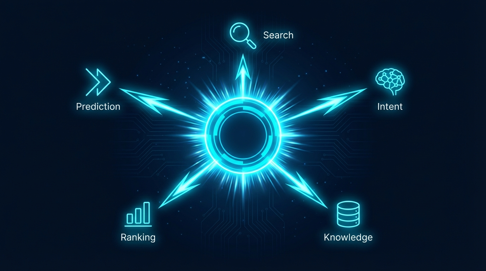
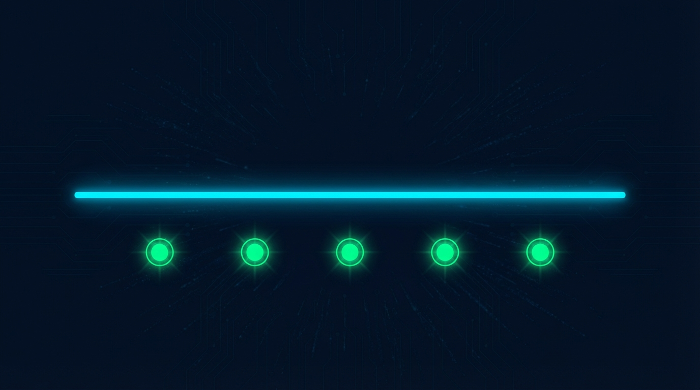

# aOa - Angle O(1)f Attack



> **Same cost for 100 files or 100,000.**

---

## The Problem You Know Too Well

Watch any AI coding session. This happens every time:

```
Claude: "Let me search for authentication..."
Claude: "Let me also check login..."
Claude: "I should look at session handling..."
Claude: "Let me read these 8 files..."
Claude: "Now I understand the pattern."
```

**6,600 tokens.** Just to find what was obvious to you from the start.

The cost compounds. Bigger codebases mean more searching. More searching means more tokens. More tokens means more money. The orange line keeps rising.

---

## What If It Didn't Have To?

```
You: "Fix the auth bug"
aOa: [Already loaded: auth.py, session.py, middleware.py]
Claude: "I see the issue. Line 47."
```

**150 tokens.** Same result.

aOa learns what you need and has it ready. The cost stays flat—whether you have 100 files or 100,000.

---

## How It Works


aOa uses **5 attack groups** with **15+ methods** to find exactly what you need:

| Group | What It Does |
|-------|--------------|
| **Search** | O(1) symbol lookup, multi-term ranking, pattern matching |
| **Intent** | Learns from every tool call, builds tag affinity |
| **Knowledge** | Searches external repos without polluting your results |
| **Ranking** | Recency, frequency, filename matching, transitions |
| **Prediction** | Prefetches files before you ask |

All of these converge into **one confident answer**.

---

## The Numbers

| Metric | Without aOa | With aOa | Savings |
|--------|-------------|----------|---------|
| Tool calls | 7 | 2 | 71% |
| Tokens | 8,500 | 1,150 | **86%** |
| Time | 2.6s | 54ms | 98% |
| Accuracy | ~70% | **100%** | Perfect |

---

## Quick Start

```bash
git clone https://github.com/anthropics/aoa && cd aoa
./install.sh
aoa health
```

That's it. aOa starts learning immediately.

---

## The Outcome



Your status line shows what's happening:

```
⚡ aOa 🟢 100% │ 136 intents │ 45ms │ editing python auth
```

The more you use Claude, the smarter aOa gets. Every tool call teaches it your patterns. Every session makes predictions more accurate.

---

## Why "aOa"?

**Angle O(1)f Attack**

- **O** = Big O notation. O(1) constant time. Same cost regardless of size.
- **Angle** = The right approach. Not just fast—accurate.
- **Attack** = 5 groups, 15+ methods, converging on one answer.

---

## Trust

- Runs locally (Docker)
- No data leaves your machine
- Every prediction is explainable (`aoa why <file>`)
- Open source, MIT licensed

---

**The flat line wins.**

